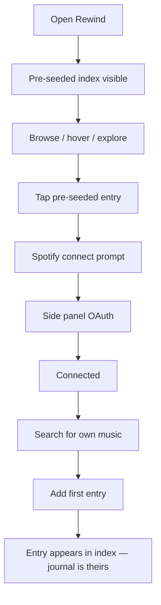

# UX Design Specification: Rewind

**Author:** Ankush G
**Date:** 2026-03-22

---

## Executive Summary

### Project Vision

Rewind is a personal typographic music journal where the interface *is* the experience. The primary view is a dense, flowing typographic index of artist and album names — rendered in large-scale dotted/stencil letterforms inspired by gallery archive indexes — with album artwork appearing inline. The aesthetic is raw and editorial, closer to a zine than a tech product. A secondary handwritten layer (journal notes, digital postcards) provides intimate contrast to the bold index.

### Target Users

- **Primary**: A design-minded developer using Rewind across desktop (journaling) and mobile (browsing, quick capture, sharing). Single user, no multi-tenancy.
- **Secondary**: A close friend or partner who receives a shared link and browses the journal as a read-only artifact.

### Key Design Challenges

- **Dense from day one**: The typographic index must feel full and rich even with only a handful of entries. The layout cannot rely on volume to look good — it must feel expressive at 5 entries and at 500.
- **Responsive typography at scale**: Large, flowing text that works on both desktop and mobile without losing its editorial character. This is the hardest UX problem in the project.
- **Two-tone design language**: The bold typographic index and the intimate handwritten journal/postcard layer must coexist without clashing. Transitions between them need to feel intentional.
- **Spotify integration without breaking the aesthetic**: The search/connect flow must be functional and simple, but it can't feel like a foreign SaaS widget dropped into a zine.

### Design Opportunities

- **Japanese color palette as interaction language**: Hover states on text use colors drawn from traditional Japanese color palettes (日本の伝統色). This creates a subtle, culturally specific interaction layer that reinforces the intentional aesthetic.
- **Artwork as portal**: Album art in the index has an animated zoom on hover and taps through to the journal detail page — making artwork the bridge between browsing and reflecting.
- **Typography as identity**: Because the index IS the UI, every typographic choice (weight, spacing, size variation, flow) directly shapes the emotional experience.

### Interaction Specifications

| Element | Hover | Tap/Click |
|---------|-------|-----------|
| **Artist/album text** | Color shifts to a Japanese palette color | Navigates to journal/detail page |
| **Inline album artwork** | Animated zoom-in | Navigates to journal/detail page |
| **Spotify connect** | — | Top icon opens side panel for Spotify OAuth |
| **Search** | — | Side panel search interface, simple and functional |

### Index Layout Rules

- **Order**: Chronological by date added (newest first)
- **Density**: Layout must feel full and rich from the very first entries. Use typographic scale variation, spacing, and artwork placement to fill the canvas regardless of entry count.
- **Navigation**: Deferred — the index is the primary (and currently only) interface surface

---

## Core User Experience

### Defining Experience

The core experience of Rewind is **browsing the typographic index**. Not adding, not searching, not writing — *looking*. Scrolling through a dense landscape of artist names and album art, re-encountering something you saved months ago, feeling a color shift under your cursor. The index is designed for lingering. It is a first-class experience on its own, not a launchpad to somewhere else.

Adding music is secondary and optimized for **speed**: search, tap, done, back to the index. The tool disappears. The archive grows.

### Platform Strategy

- **Web-first** (Next.js), deployed to Vercel
- **Responsive**: Desktop for extended browsing and journaling, mobile for quick browsing, captures, and sharing links
- **Touch and mouse**: Hover interactions (color shift, artwork zoom) are desktop; tap interactions carry the same intent on mobile
- **No offline requirement**: Spotify integration requires connectivity; offline is not a design goal

### Effortless Interactions

- **Browsing**: Zero friction. Open Rewind, scroll, linger. No loading states that break the flow. The index should feel like a printed page — it's just *there*.
- **Adding music**: Fast. Side panel search, tap to add, entry appears in the index. No forms, no confirmation dialogs, no multi-step flow.
- **Spotify connect**: One-time setup. Icon at top, side panel opens, OAuth flow, done. Never asked again.

### Critical Success Moments

- **First open**: The index is pre-seeded with a random curated entry. It's not empty. The user sees what Rewind *feels like* before they've added anything. Clicking the pre-seeded entry prompts them to connect Spotify and start making it their own.
- **First addition**: The moment a user's own artist name appears in the typographic index. The journal becomes *theirs*.
- **The re-encounter**: Scrolling the index weeks later and seeing something they forgot they saved. The color shifts under their cursor. They tap in and read what they wrote. That's the loop closing.

### Experience Principles

1. **Browsing is the product** — The index isn't a means to an end. It's the experience itself. Design for lingering.
2. **Tools disappear** — Search, connect, add — these are fast, minimal, and get out of the way. The index always returns.
3. **Motion with intention** — Every animation (artwork zoom, color shift) exists to create a moment of presence, not to decorate. No motion without purpose.
4. **Dense from day one** — The layout never feels empty or under-furnished, regardless of entry count.

---

## Desired Emotional Response

### Primary Emotional Goals

- **Presence**: Opening Rewind shifts attention. The dense typography and subtle interactions pull the user out of autopilot and into intentional engagement.
- **Ownership**: This is *mine*. The journal feels personal, handmade, specific. It couldn't belong to anyone else.
- **Quiet satisfaction**: Not excitement, not productivity. A calm feeling of "I made something meaningful here."

### Emotional Journey Mapping

| Moment | Feeling |
|--------|---------|
| **First open (pre-seeded)** | Curiosity — "What is this? This looks different." |
| **Connecting Spotify** | Anticipation — "Let me make this mine." |
| **First entry appears in index** | Ownership — "There it is. This is real now." |
| **Browsing the index** | Presence — Meditative, unhurried. Like flipping through a well-made book. |
| **Hovering text, seeing color shift** | Delight — A small, intentional surprise. The palette feels considered. |
| **Hovering artwork, seeing zoom** | Connection — The album becomes tangible, not just a name. |
| **Writing a journal note** | Intimacy — The handwritten feel makes it personal, not performative. |
| **Re-encountering an old entry** | Warmth — "I forgot about this. I'm glad I saved it." |
| **Sharing with someone close** | Vulnerability — "Here, this is who I am." |

### Micro-Emotions

- **Confidence over confusion**: Every interaction should feel obvious. No "what do I click?" moments.
- **Delight over mere satisfaction**: The color palette, the motion, the typography — these should spark small moments of "that's nice" repeatedly.
- **Calm over urgency**: Rewind is not a feed. There's no new content to catch up on. No FOMO. Just your own archive, waiting.

### Design Implications

| Emotion | UX Choice |
|---------|-----------|
| **Presence** | Dense, full-screen typography with no chrome or distracting UI elements |
| **Ownership** | Pre-seeded entry gives way to user's own entries; the index becomes uniquely theirs |
| **Quiet satisfaction** | No notifications, no streaks, no gamification. The reward is the artifact itself. |
| **Delight** | Japanese color palette hover states, artwork zoom animations — small, repeated, intentional |
| **Calm** | No infinite scroll anxiety. The index is finite — it's *your* collection, not a feed. |
| **Intimacy** | Handwritten-feel typography in journal/postcard layers contrasts with the bold index |

### Emotional Design Principles

1. **Cool archive, warm journal** — The index feels like a gallery. The notes feel like a notebook. The temperature shifts with the context.
2. **Never empty, never anxious** — No blank states, no urgency cues, no "you haven't added anything in a while."
3. **Every interaction earns its motion** — Animations create feeling, not flash. If it moves, it should make the user more present, not more distracted.

---

## UX Pattern Analysis & Inspiration

### Inspiring Products Analysis

**1. Unlocked/Reconnected (unlockedreconnected.nl) — PRIMARY REFERENCE**

The direct aesthetic ancestor for Rewind's index view. Key UX patterns:

- **Custom dotted/stencil font** (based on Nina Stössinger's Sélavy) as the dominant visual element — text IS the interface
- **Varied text scale**: Institution names at massive sizes, artwork titles and artist names at smaller sizes. The scale variation creates visual rhythm without relying on grid structure.
- **Inline artwork thumbnails**: Small rectangular images scattered between text entries, breaking the typographic flow just enough to create texture without overwhelming it
- **Flowing, non-grid layout**: Text wraps and flows naturally, closer to typeset prose than a structured list. Entries feel like they belong to a continuous visual field, not discrete rows.
- **Minimal chrome**: Simple top navigation (Overzicht / Werken / INDEX / INFORMATIE), otherwise the typography fills the entire viewport
- **Click-to-expand detail**: Tapping an entry reveals a detail overlay with artwork, description, and metadata — the index never leaves
- **Font stack**: Custom Sélavy-based dotted font + Suisse Int'l Mono for metadata

**What to carry into Rewind**: Nearly everything. The dotted letterforms, the flowing layout, the inline artwork, the scale variation, the minimal chrome. Rewind should feel like a sibling of this interface, adapted for music instead of visual art.

**2. My Boyfriend Magazine (my-boyfriend.com) — EDITORIAL VOICE**

A literary zine online. Key UX patterns:

- **Raw, intentional layout**: Feels handmade and considered, not templated. Bold type, unconventional spacing, playful use of emoji as section markers.
- **Content-as-design**: The writing and the visual design are inseparable. Typography choices serve the mood of the content.
- **Dense text hierarchy**: Large contributor names, body text, pull quotes — all on one scrollable page with no pagination or card grids.
- **Anti-SaaS aesthetic**: No rounded corners, no card shadows, no whitespace-heavy modern web patterns. Deliberately rough.

**What to carry into Rewind**: The handmade, zine-like confidence. The refusal to look like a "web app." The idea that the content (music entries) and the design are one thing, not content inside a container.

**3. WePresent by WeTransfer (wepresent.wetransfer.com) — EDITORIAL CRAFT**

An arts editorial platform. Key UX patterns:

- **Full-bleed imagery**: Photography and artwork dominate. Text serves the visuals, not the other way around.
- **Storytelling hierarchy**: Large titles, rich introductions, then deep content. Every page has a clear emotional arc.
- **Clean but not sterile**: Modern layout with generous spacing, but warm and inviting rather than corporate.
- **Scroll-driven narrative**: Content reveals itself through scrolling. No tabs, no sidebars — just a linear, immersive experience.

**What to carry into Rewind**: The immersive scroll experience. The idea that browsing itself should feel like reading a beautiful publication. The confidence to let content breathe.

### Transferable UX Patterns

**Typography Patterns**
- Dotted/stencil letterforms at massive scale (from Unlocked/Reconnected) — directly applicable to the index
- Scale variation to create rhythm without grid structure — entries at different sizes based on recency, personal significance, or compositional balance
- Monospace secondary type for metadata (dates, album info) — Suisse Int'l Mono or similar

**Layout Patterns**
- Flowing, non-grid text layout where entries wrap naturally across the viewport
- Inline artwork breaking the text flow as visual punctuation, not as a separate gallery
- Full-viewport typography with minimal UI chrome — no sidebar, no persistent header, no footer clutter

**Interaction Patterns**
- Overlay/expand for detail (from Unlocked/Reconnected) — tap an entry, detail slides in without leaving the index context
- Scroll as the primary interaction — linear, immersive, no pagination
- Hover as discovery (color shift on text, zoom on artwork) — desktop delight layer

**Density Patterns**
- Start dense by varying scale — even with few entries, large/medium/small text sizes fill the viewport
- Artwork thumbnails scattered asymmetrically to break up text mass
- No empty states — the layout always feels full

### Anti-Patterns to Avoid

- **B2B / SaaS aesthetics**: No card grids, no rounded corners with shadows, no dashboard layouts, no "Add your first item!" empty states. Rewind is not a product — it's an artifact.
- **Spotify-style album grids**: No square grid of album covers. The artwork serves the typography, not the other way around.
- **Modern "clean" web app patterns**: No excessive whitespace, no centered single-column content, no hero sections with CTAs. These all signal "tool," not "journal."
- **Social media patterns**: No feeds, no timestamps in relative format ("2 hours ago"), no engagement metrics, no infinite scroll anxiety.
- **Template-driven layouts**: Every entry looking identical. The index should have visual variety — scale differences, artwork placement shifts — so it feels composed, not generated.

### Design Inspiration Strategy

**Adopt directly:**
- Dotted/stencil font approach (Sélavy-inspired or similar) for the index
- Flowing, non-grid text layout with inline artwork thumbnails
- Minimal chrome — the typography IS the interface
- Monospace secondary font for metadata
- Click/tap to expand detail without leaving the index

**Adapt:**
- Unlocked/Reconnected's location-based structure → chronological ordering for Rewind
- Unlocked/Reconnected's static artwork thumbnails → interactive (zoom on hover, portal to detail)
- WePresent's editorial scroll → apply to the detail/journal pages, not just the index

**Reject:**
- Any pattern that makes Rewind look like an app instead of an archive
- Any pattern that prioritizes information density over emotional density
- Any corporate or B2B design language

---

## Design System Foundation

### Design System Choice

**Custom design system** built on Tailwind CSS utilities, with raw CSS for expressive typographic treatments. No pre-built component library.

### Rationale for Selection

- **Rewind has no standard UI components**: The interface is text, images, and a search panel. There are no dashboards, data tables, or complex form flows that would benefit from a component library.
- **The aesthetic actively rejects component library defaults**: Card grids, rounded buttons, shadow elevations — these are anti-patterns for Rewind. A pre-built system would need to be overridden at every turn.
- **Flexibility over speed**: As a design playground, Rewind needs full creative control. Every typographic decision, every spacing choice, every motion curve should be intentional and hand-tuned.
- **Solo developer**: No team consistency concerns. The design system needs to serve one person's creative vision, not enforce conventions across a team.

### Implementation Approach

- **Tailwind CSS**: Utility-first for responsive layout, spacing, color, and basic typography. Handles the responsive scaling challenge efficiently.
- **Raw CSS / CSS Modules**: For the dotted/stencil font treatments, flowing text layout, artwork positioning, and any typographic expression where Tailwind class lists become unwieldy.
- **CSS custom properties**: For design tokens (Japanese color palette, type scale, motion timing) — easy to reference across both Tailwind config and raw CSS.
- **No component library**: Components are built from scratch as needed — they'll be simple and few (index entry, artwork thumbnail, search panel, journal note editor).

### Customization Strategy

**Design Tokens:**

| Token Category | Examples |
|---------------|----------|
| **Typography** | Dotted/stencil display font, monospace metadata font, handwritten notes font |
| **Color palette** | Japanese traditional colors (日本の伝統色) for hover states, neutral background, text colors |
| **Type scale** | Index entry sizes (large/medium/small) for density variation |
| **Motion** | Artwork zoom duration/easing, color transition timing, page transition curves |
| **Spacing** | Index entry gaps, artwork inline offsets, viewport margins |

**Custom Components (built as needed):**
- `IndexEntry` — typographic entry with scale variation and hover color
- `InlineArtwork` — album art thumbnail with zoom hover and tap-through
- `SearchPanel` — side panel for Spotify search
- `JournalNote` — handwritten-feel text editor (v0.3)
- `PostcardComposer` — "This made me think of you" interface (v0.4)

---

## Defining Experience

### The Defining Interaction

**"Scroll through your music like flipping through a zine you made."**

The defining experience of Rewind is the typographic index as a browsable artifact. If a user described Rewind to a friend, they'd say: "It's like a personal music archive that looks like a gallery index — you scroll through these big artist names and album art, and you can tap into any of them to read what I wrote about it."

The core action isn't adding, searching, or writing. It's *looking*. The index is designed for the gaze to wander.

### User Mental Model

The mental model is a **printed index or exhibition catalog**, not a digital music library. Users bring the expectation of:
- **Reading, not clicking** — The index is text-first, and text is meant to be read/scanned, not navigated like a menu
- **Browsing, not searching** — You don't come with a specific target. You come to see what's there.
- **Tangibility** — The dotted letterforms and dense layout evoke physical print. The artwork thumbnails feel like they're "peeking through" the page.

No existing music app uses this mental model. Spotify is a search-and-play tool. Last.fm is a data dashboard. Rewind is closer to a bookshelf or a gallery wall.

### Success Criteria

| Criteria | Indicator |
|----------|-----------|
| **Feels like browsing, not using** | User spends time scrolling without a goal and enjoys it |
| **Text is the star** | Artist names are the first thing noticed, not UI elements |
| **Artwork creates moments** | Hovering/tapping artwork feels like discovering something |
| **Speed of addition** | Adding music takes < 5 seconds from search to index |
| **Seamless transition** | Tapping an entry feels like going *inside* it, not loading a new page |

### Novel UX Patterns

Rewind combines familiar elements in an unfamiliar way:

- **Familiar**: Scrolling, tapping, text links, search panels
- **Novel**: Typography as the entire UI surface (no cards, no grids, no chrome). The flowing, non-grid layout with inline artwork. Color-shift hover states from a curated Japanese palette.
- **No education needed**: Every interaction uses basic web gestures (scroll, hover, tap). The novelty is aesthetic, not functional.

### Experience Mechanics

**Browsing the Index:**
1. **Initiation**: Open Rewind. The index is immediately there — no splash, no loading, no landing page.
2. **Interaction**: Scroll through dense, flowing typography. Hover over artist names → color shifts (Sanzo Wada palette). Hover over artwork → animated zoom.
3. **Feedback**: Color and motion confirm interactivity. The palette colors feel intentional and surprising each time.
4. **Continuation**: Tap an entry → full page transition, moving *into* the entry. The index recedes. The detail/journal page emerges.

**Adding Music:**
1. **Initiation**: Tap the Spotify icon (top of viewport). Side panel slides in.
2. **Interaction**: Type to search. Results appear. Tap to add.
3. **Feedback**: Entry appears in the index immediately. Panel can stay open or close.
4. **Completion**: The new artist name is now part of the typographic landscape.

---

## Visual Design Foundation

### Color System

**Background**: Light — off-white or warm white, close to uncoated paper stock. Not pure `#fff` (too clinical). Something in the range of `#F5F3EF` to `#FAF9F6` — warm, papery, slightly aged.

**Text**: Near-black — not pure `#000`. A warm dark like `#1A1A1A` or `#2B2B2B` for the dotted/stencil display font. The text should feel printed, not digital.

**Hover Palette**: Drawn from [Sanzo Wada's Dictionary of Color Combinations](https://sanzo-wada.dmbk.io/). Each text hover randomly or sequentially selects from a curated set of Wada color pairings. Candidate combinations to explore:

- Muted terracotta, moss green, slate blue
- Soft vermillion, ochre, deep teal
- Dusty rose, sage, charcoal
- Warm coral, indigo, wheat

The specific combinations should be pulled from Wada's book and tested against the off-white background for contrast and delight. 6-10 hover colors in rotation keeps it surprising but cohesive.

**Metadata**: Lighter gray for monospace secondary text (dates, album names when paired with large artist names). Around `#8A8A8A` to `#6B6B6B`.

### Typography System

| Role | Font | Character |
|------|------|-----------|
| **Display / Index** | Sélavy-inspired dotted/stencil font (or custom alternative) | Large, expressive, the hero of the UI. Varies in scale across entries. |
| **Metadata** | Suisse Int'l Mono (or similar monospace) | Small, precise, utilitarian. Dates, album titles when secondary. |
| **Journal Notes** | Handwritten / script font (TBD — e.g., Caveat, Reenie Beanie, or custom) | Warm, intimate, personal. Contrasts with the bold index. |
| **UI / System** | System font stack or neutral sans-serif | Invisible — for search panel, settings, anything functional. |

**Type Scale (Index):**
- **Large entries**: 6-10vw on desktop, 12-18vw on mobile — these are the visual anchors
- **Medium entries**: 3-5vw on desktop, 8-12vw on mobile — fill space, create rhythm
- **Small entries**: 1.5-2.5vw on desktop, 5-7vw on mobile — density and texture
- Scale assignment can be random, chronological weighting (newer = larger), or manually set

### Spacing & Layout Foundation

- **No grid**: The index is a flowing text field. Entries wrap and fill the viewport naturally, with irregular spacing that feels composed rather than computed.
- **Artwork placement**: Inline with text flow, not on a grid. Thumbnails vary in size (40px–120px) and sit between text entries asymmetrically.
- **Viewport margins**: Generous but not excessive — ~5-8vw on desktop, ~4vw on mobile. Enough to feel like the text has room to breathe without wasting space.
- **Base spacing unit**: 8px for structural spacing (panel padding, component gaps). But the index itself uses fluid, non-uniform spacing for visual interest.

### Accessibility Considerations

- Color contrast ratios must meet WCAG AA for body text (~4.5:1 against off-white background)
- Hover colors from Wada palette must be tested for readability — decorative shift is fine if the text remains legible
- Touch targets for artwork thumbnails: minimum 44×44px on mobile
- Keyboard navigation: entries should be focusable and navigable with tab/enter
- Reduced motion preference: respect `prefers-reduced-motion` for artwork zoom and color transitions

---

## Design Direction Decision

### Design Directions Explored

Given the clarity of the style reference (Unlocked/Reconnected) and the directive to "follow as much as possible," the exploration focused on one primary direction with variations in detail, rather than divergent visual approaches.

### Chosen Direction

**"The Archive"** — A direct adaptation of the Unlocked/Reconnected typographic index aesthetic, translated from visual art to music. Characteristics:

- Light, papery background with warm near-black dotted/stencil typography
- Flowing, non-grid text layout filling the full viewport
- Inline album artwork thumbnails scattered asymmetrically between entries
- Sanzo Wada color palette for hover states — a curated, rotating set of muted-to-vivid Japanese colors
- Minimal chrome — a single Spotify icon at top, nothing else persistent
- Full-page transition on tap — "going inside" an entry to the journal/detail view
- Monospace metadata for dates and secondary info
- Handwritten-feel typography reserved for the journal layer (v0.3)

### Design Rationale

- **The reference works**: Unlocked/Reconnected is a proven implementation of this exact aesthetic at scale (167 entries). The interaction model, density management, and typographic approach have been validated.
- **Music is a natural fit**: Artist/album names have the same expressive variety as gallery/institution names. The index will feel native, not forced.
- **Sanzo Wada palette adds identity**: The hover colors give Rewind its own personality within the reference's framework. The curated, historical color combinations reinforce the intentional, non-digital aesthetic.
- **Full-page transitions create depth**: Moving "into" an entry rather than overlaying creates a stronger sense of the journal as a layered artifact — surface (index) and interior (notes).

### Implementation Approach

**Phase 1 (v0.1 — The Index):**
1. Source or create a dotted/stencil display font (Sélavy-based or equivalent)
2. Build the flowing text layout with CSS (no grid framework)
3. Implement scale variation system for entries (large/medium/small)
4. Add inline artwork thumbnails with zoom hover animation
5. Implement Sanzo Wada color palette hover states on text
6. Ensure responsive behavior — the layout should reflow naturally on mobile
7. Pre-seed with one curated entry for first-open experience

**Phase 2 (v0.2 — Add Music):**
8. Build side-panel search interface
9. Connect Spotify Web API for search
10. Implement Supabase persistence
11. New entries appear in index with animation

---

## User Journey Flows

### Journey 1: First Open & Spotify Connect

The onboarding journey — from stranger to owner.

```
Open Rewind → Pre-seeded index (one curated entry) → Browse, hover, feel the aesthetic
→ Tap entry → Spotify connect prompt → Side panel OAuth → Connected
→ Search for own music → Add first entry → Name appears in index → Journal is theirs
```



**Error paths:**
- OAuth cancelled → panel shows "Connect when you're ready," returns to index
- OAuth failure → inline error in panel, retry option
- Network down → "Can't reach Spotify right now" in panel

### Journey 2: Adding Music

The fast utility loop — in and out in under 5 seconds.

```
Tap Spotify icon (top) → Side panel slides in → Type search query → Results appear
→ Tap to add → Entry appears in index immediately → Panel stays open or closes
→ Back to browsing
```

**Target:** < 5 seconds from icon tap to entry in index.

**Error paths:**
- No Spotify connection → redirect to OAuth
- No results → "Nothing found" inline text
- Network failure → subtle inline error, panel stays open

### Journey 3: Browsing the Index (Core Loop)

The primary experience — designed for lingering.

```
Open Rewind → Index is immediately there (no splash, no loading)
→ Scroll through dense typography → Hover artist names → color shifts (Wada palette)
→ Hover artwork → animated zoom → Tap entry → Full page transition ("going inside")
→ Detail/journal page → Read notes / listen context → Navigate back → Index reappears
```

No entry point friction. No login wall. The index loads as if it were a printed page.

### Journey 4: Writing a Journal Note (v0.3)

```
Tap entry in index → Full page transition to detail → Album art, metadata visible
→ Tap to write → Handwritten-feel text editor → Write freely → Auto-saves
→ Navigate back to index
```

### Journey 5: Sending a Digital Postcard (v0.4)

```
From detail page → "This made me think of you" action → Postcard composer opens
→ Handwritten-style note field → Generate shareable link → Copy/send
→ Recipient opens link → Sees album art + handwritten note as a self-contained postcard
```

### Journey Patterns

- **Entry is always via the index** — no deep links bypass the typographic experience (except postcards, which are standalone artifacts)
- **Side panel for tools, full page for content** — search/connect live in a panel; journals/postcards get their own page
- **Auto-save everywhere** — no "save" buttons. Notes persist as you type.
- **Transition direction signals depth** — entering a detail page = going deeper (full page transition in). Returning = surfacing (reverse transition).

### Flow Optimization Principles

- **Zero-step browsing**: The index requires no action to begin. It's just there.
- **One-step adding**: Tap result → added. No confirmation dialogs.
- **One-step connecting**: OAuth is a single flow, never repeated.
- **Instant feedback**: Every action has an immediate visual response (entry appears, color shifts, panel slides).
- **Graceful degradation**: Errors are inline, contextual, and non-blocking. The index always remains accessible.

---

## Component Strategy

### Design System Components

No pre-built design system components are used. Rewind's custom design system is built entirely on Tailwind CSS utilities and raw CSS/CSS Modules. Every component is purpose-built.

### Custom Components

| Component | Purpose | Phase | Priority |
|-----------|---------|-------|----------|
| `IndexEntry` | Typographic entry with scale variation, Wada hover color, tap navigation | v0.1 | Critical |
| `InlineArtwork` | Album art thumbnail with zoom hover, tap-through to detail | v0.1 | Critical |
| `IndexLayout` | Flowing, non-grid container that positions entries and artwork | v0.1 | Critical |
| `PageTransition` | Full-page transition wrapper for index ↔ detail navigation | v0.1 | Critical |
| `SpotifyIcon` | Persistent top-of-viewport icon, triggers side panel | v0.2 | High |
| `SearchPanel` | Side panel with search input, results list, tap-to-add | v0.2 | High |
| `SearchResult` | Individual result row (artwork, artist, album, add action) | v0.2 | High |
| `DetailPage` | Album detail layout — artwork, metadata, journal note area | v0.3 | Medium |
| `JournalEditor` | Handwritten-feel text editor with auto-save | v0.3 | Medium |
| `PostcardComposer` | Album selection + handwritten note + shareable link | v0.4 | Low |
| `PostcardView` | Read-only postcard artifact for the recipient | v0.4 | Low |

### Component Specifications (v0.1 Critical)

**IndexEntry**
- **Purpose:** A single artist/album name in the typographic index
- **States:** Default (near-black text), hovered (Wada palette color, ~200ms transition), focused (keyboard — outline + color shift), tapped (navigates to detail)
- **Variants:** Large (6-10vw), Medium (3-5vw), Small (1.5-2.5vw) — assigned per entry based on recency or composition
- **Accessibility:** Focusable, role="link", keyboard navigable (tab/enter), announced as "[Artist] — [Album], added [Date]"
- **Props:** Artist name, album name, scale tier, Spotify ID, entry date, hover color

**InlineArtwork**
- **Purpose:** Album art thumbnail scattered between text entries
- **States:** Default (static), hovered (animated zoom 1.0→1.15, ~300ms ease-out), tapped (navigates to detail)
- **Variants:** Size varies (40-120px) based on layout position
- **Accessibility:** Alt text from album name, minimum 44×44px touch target, respects `prefers-reduced-motion`

**IndexLayout**
- **Purpose:** The flowing text container — positions entries and artwork in a non-grid, wrap-and-fill layout
- **Behavior:** Entries flow naturally like typeset prose. Artwork breaks the text flow as visual punctuation. Dense from day one regardless of entry count.
- **Responsive:** Type scale and artwork sizes adapt via vw units and `clamp()`. No explicit breakpoints for the flow itself.

**PageTransition**
- **Purpose:** Full-page transition when navigating index ↔ detail
- **Behavior:** Index recedes (scale down + fade), detail emerges (scale up + fade in). Reverse on back. Duration ~400-500ms.
- **Implementation:** CSS transitions or Framer Motion with Next.js App Router
- **Accessibility:** Respects `prefers-reduced-motion`, maintains focus management across transition

### Component Implementation Strategy

- Build v0.1 critical components first — they constitute the entire index experience
- Each component owns its own styles via CSS Modules or colocated Tailwind
- Design tokens (Wada colors, type scale, motion timing) live in CSS custom properties, shared across all components
- No abstraction until repetition demands it — start concrete, extract patterns later

---

## UX Consistency Patterns

### Hover Patterns

- **Text hover:** Color shifts to a random Wada palette color. CSS transition ~200ms ease. Desktop only.
- **Artwork hover:** Scale zoom from 1.0 to 1.15. CSS transition ~300ms ease-out. Desktop only.
- **No hover on mobile** — all interactions are tap-only on touch devices.

### Tap/Click Patterns

- **Artist/album text:** Navigate to detail page (full page transition)
- **Artwork thumbnail:** Navigate to detail page (full page transition)
- **Spotify icon:** Toggle side panel open/closed
- **Search result:** Add entry to index (instant, no confirmation dialog)
- **Back from detail:** Browser back or minimal back affordance on detail page

### Transition Patterns

- **Index → Detail:** Full page transition. Index content animates out (scale down + fade), detail page animates in (scale up from center + fade in). ~400-500ms.
- **Detail → Index:** Reverse of above.
- **Side panel:** Slides in from right, ~250ms. Background dims slightly.
- **New entry appearing:** Fade in at natural position in index, ~300ms.

### Feedback Patterns

- **Entry added:** New entry fades into index. No toast, no modal, no confirmation. The entry IS the feedback.
- **Spotify connected:** Panel updates to show search interface. The ability to search IS the confirmation.
- **Errors:** Inline, subtle, within context (e.g., "Couldn't connect" in side panel). No global banners or alerts.
- **Loading:** No spinners in the index. Side panel search shows minimal pulsing dots during fetch.

### Empty State Pattern

There is no empty state. The index is pre-seeded with a curated entry. After Spotify connect, user entries join or replace it.

### Navigation Patterns

- No persistent navigation bar, hamburger menu, or footer
- Single Spotify icon at top of viewport — the only persistent UI element
- Back navigation from detail → index via browser back or a minimal back affordance
- Side panel for all tool interactions (search, connect)

---

## Responsive Design & Accessibility

### Responsive Strategy

| Aspect | Desktop (1024px+) | Tablet (768-1023px) | Mobile (<768px) |
|--------|-------------------|---------------------|-----------------|
| **Type scale** | Large: 6-10vw, Med: 3-5vw, Small: 1.5-2.5vw | Large: 8-12vw, Med: 5-8vw, Small: 3-5vw | Large: 12-18vw, Med: 8-12vw, Small: 5-7vw |
| **Margins** | 5-8vw | 4-6vw | 4vw |
| **Artwork size** | 60-120px | 50-100px | 40-80px |
| **Search panel** | Side panel (right, ~400px wide) | Side panel (right, ~50% width) | Full-screen overlay |
| **Hover states** | Color shift + artwork zoom | Color shift + artwork zoom | None (tap-only) |
| **Detail page** | Generous layout, large artwork | Balanced layout | Stacked vertical — artwork then text |

### Breakpoint Strategy

Mobile-first. Base styles target mobile, then layer up with `min-width` media queries. The flowing text layout naturally reflows without explicit breakpoints — vw-based sizing handles most adaptation. Breakpoints are primarily for search panel behavior and artwork sizing.

### Accessibility Strategy (WCAG AA)

**Color Contrast:**
- Near-black text (#1A1A1A) on off-white (#F5F3EF) = ~14:1 ratio (exceeds AA)
- Wada hover colors tested individually — any below 4.5:1 against background get a subtle text-shadow or are excluded from the rotation

**Keyboard Navigation:**
- All index entries focusable (`tabindex="0"` or semantic links)
- Tab moves through entries sequentially
- Enter navigates to detail page
- Escape closes side panel
- Visible focus ring on all interactive elements (warm-toned outline, not browser default blue)

**Screen Reader:**
- Entries announced as "[Artist Name] — [Album Name], added [Date]"
- Artwork has descriptive alt text ("[Album Name] album artwork")
- Side panel has `aria-label` and `role="dialog"`
- Page transitions announce the new context

**Touch Targets:**
- All tappable elements minimum 44×44px on mobile
- Artwork thumbnails smaller than 44px visually get padding to expand tap area

**Reduced Motion:**
- `prefers-reduced-motion: reduce` disables artwork zoom, color transitions, and page transitions
- Content changes still occur, but instantly rather than animated

**Font Scaling:**
- Layout respects user font-size preferences
- vw-based sizes use `clamp()` with minimum floors to prevent unreadably small text

### Testing Approach

- Manual testing on iPhone Safari, Android Chrome, desktop Chrome/Safari/Firefox
- Axe or Lighthouse for automated accessibility audits
- Keyboard-only navigation walkthrough for all user journeys
- `prefers-reduced-motion` tested explicitly
